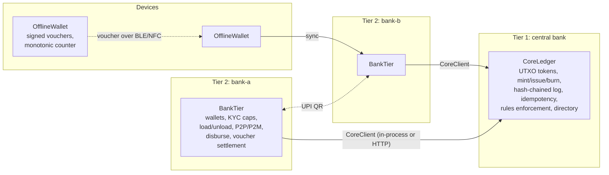

# Rupee Rails

A two-tier retail CBDC sandbox modelled on India's e₹ (Digital Rupee): a central-bank core
ledger, banks that distribute wallets, programmable money for subsidies, and offline payments
with double-spend detection. TypeScript, no external services, `npm test` and `npm run demo`
tell the whole story.

```
$ npm run demo

01. RBI mints ₹20,00,000 and issues ₹10,00,000 to each bank against reserves
    invariant ok: unspent ₹20,00,000.00 = minted ₹20,00,000.00 - burned ₹0.00, 3 entries, chain intact
...
06. The core enforces the rules on every spend
    subsidy at a grocery: rejected MCC_NOT_ALLOWED (FERT-SUBSIDY-2026 tokens cannot be spent at MCC 5411)
    subsidy at a dealer 400 km away: rejected OUTSIDE_GEOFENCE (... 462 km outside their zone)
    dealer inside the zone: paid ₹1,500.00; change ₹500.00 stays purpose-bound; the dealer received ordinary e₹
07. 91 days later the unspent subsidy expires and is swept back to the scheme
09. Attack: Ravi's device is cloned; both copies issue counter 2 to different merchants
    first to sync:  {"ok":true,"txId":"tx_…"}
    second to sync: {"ok":false,"code":"DOUBLE_SPEND","message":"voucher vch_… reuses counter 2 of vch_…"}
    Ravi's wallet frozen: true
11. Done: ledger entries 14, hash chain intact, conservation holds
```

## Why this exists

RBI's retail e₹ runs as a two-tier system: the central bank mints, issues and destroys tokens
on a permissioned core, and banks (plus, since 2024, non-bank wallet providers) onboard
customers, enforce KYC limits and move value. Two features make it more than "UPI again":
purpose-bound programmable money, which RBI has piloted for fertiliser subsidies, and offline
transfers between devices, which was one of the three HaRBInger 2025 problem statements.

This repository is a working model of all of that, small enough to read in an afternoon and
tested well enough to argue with. It is a sandbox, not a product; the limitations section says
exactly where it stops.

## Architecture



| e₹ concept | Where it lives | What it does here |
|---|---|---|
| Token-based bearer instrument, cash-like denominations | `src/money.ts`, `src/ledger.ts` | Every token carries one of the standard denominations (50p to ₹500). Transfers spend inputs and re-denominate outputs; inputs and outputs always balance. |
| Central bank mints, issues, destroys | `CoreLedger.mint/issue/burn/redeem` | Only the RBI key can mint or burn. `issue` moves tokens to a bank's pool and debits its reserve account; `redeem` reverses it. |
| Two-tier distribution | `src/bank.ts`, `src/core-client.ts` | Banks hold customer wallets and talk to the core through one interface, in-process or over HTTP. |
| KYC-tiered wallet limits | `KYC_LIMITS`, `BankTier.load/payP2P/payQr` | Minimum-KYC wallets have a balance cap and a daily outgoing cap; full-KYC wallets have higher ones. |
| Interoperability with UPI QR | `src/upi.ts`, `BankTier.payQr` | Standard `upi://pay?pa=…&am=…&mc=…` codes are parsed and paid from an e₹ wallet. |
| Programmable money (purpose-bound DBT) | `src/rules.ts`, `CoreLedger.transfer`, `BankTier.disburse` | Tokens carry MCC allowlists, expiry and a geofence. The core rejects non-qualifying spends, change inherits the rules, a qualifying merchant receives ordinary e₹, and expired tokens are swept back to the scheme. |
| Offline payments | `src/offline.ts`, `BankTier.prefundOffline/syncVouchers` | Devices issue Ed25519-signed vouchers with a strictly increasing counter against a pre-funded escrow. Banks settle on sync and detect double-spends. |
| Tamper-evident record | `CoreLedger.entries`, `verifyChain` | Every accepted operation is hash-linked to the previous one. |
| Audit trail | `BankTier.auditLog` | Every bank action records actor, request id, before/after balances and outcome, including rejections. |
| Settlement finality and conservation | `CoreLedger.invariants` | `sum(unspent) == minted - burned`, checked in every test and after every demo step. |

## Run it

```sh
npm install
npm test          # 36 tests incl. property-based runs (vitest + fast-check)
npm run demo      # the scenario above, in process
npm run typecheck
```

Two-process mode, the bank talking to the core over HTTP:

```sh
npm run dev:core                              # core on :4000 (set ADMIN_TOKEN to guard /admin)
BANK_ID=bank-a PORT=4001 npm run dev:bank     # boots, gets a ₹5,00,000 float from the RBI desk
BANK_ID=bank-b PORT=4002 npm run dev:bank

curl -s -X POST localhost:4001/wallets -H 'content-type: application/json' \
  -d '{"name":"Asha Patil","kyc":"min","accountBalance":500000}'
curl -s -X POST localhost:4001/wallets/bank-a:asha-patil/load -H 'content-type: application/json' \
  -d '{"amount":200000,"requestId":"load-1"}'
curl -s localhost:4001/wallets/bank-a:asha-patil
curl -s localhost:4000/invariants
```

## Design notes

**UTXO over accounts.** A retail CBDC is a bearer instrument, so the natural unit is a token,
not a balance. UTXOs give cash-like denominations, make double-spend a well-defined question
(each token is spent at most once) and let transfers be validated independently. The cost is
change handling, which `outputsFor` and `denominate` deal with.

**Signatures and custody.** Wallet keys are Ed25519. In this sandbox the bank is custodial and
signs on the customer's behalf; the same `TransferRequest` shape works unchanged if the key
moves to the customer's device. The RBI key is the only one that can mint, burn or issue.

**Idempotency, because banks retry.** Every request carries an `idempotencyKey`. A replay
returns the original result; the same key with a different payload is rejected with
`IDEMPOTENCY_CONFLICT`. This is the same discipline as payment webhooks, applied at the ledger.

**Programmable money semantics.** Rules are attached by the disbursing scheme wallet and
cannot be re-attached, relaxed or mixed by anyone else (`RULES_NOT_ALLOWED`, `MIXED_RULES`).
A spend to a qualifying merchant releases the rules on the merchant's tokens, matching the
pilot design where the dealer ends up with ordinary e₹. Change stays bound. Expiry is enforced
at spend time and cleaned up by `sweepExpired`, which returns value to the scheme.

**Offline: detect and sanction, not prevent.** A payer's device signs vouchers with a
monotonic counter and a hash link to the previous one; the payee verifies the signature offline
against a directory snapshot from its last sync and holds the voucher. On sync the bank checks
signature, escrow and counter uniqueness. A cloned device produces two vouchers with the same
counter; the second one to sync is rejected as `DOUBLE_SPEND` and the payer is frozen at both
the bank and the core. Received offline value is not re-spendable offline, which keeps the
model simple and bounded. Real deployments put the counter and key in a secure element to
prevent cloning in the first place; this sandbox deliberately shows what the bank tier must do
when that fails.

**What the property tests cover.** `test/property.test.ts` runs random interleavings of loads,
P2P payments, prefunds, vouchers, syncs and clone attacks across six wallets at two banks, and
asserts after every step that conservation holds and the hash chain verifies, and at the end
that every clone attack settled at most one voucher and flagged the other.

## Limitations, stated plainly

- In-memory state. There is no database; the point is the rules and the invariants. Persistence
  is a `CoreLedger` storage adapter away, and the hash chain is designed to survive it.
- Single-operator core. The log is tamper-evident, not distributed. RBI's production core is
  reported to be a permissioned DLT (Hyperledger Fabric); the token model here maps directly to
  Fabric's `token-utxo` sample chaincode if you want that backend.
- Custodial keys and a sandbox "RBI desk" (`/admin/*`) so one person can drive the whole
  system. Neither belongs in production.
- Offline transfers are simulated as objects passed between `OfflineWallet` instances. The
  radio layer (BLE, NFC) is out of scope.
- KYC tiers, limits, MCCs and the subsidy scheme are illustrative numbers, not RBI's.

## References

- RBI, Concept Note on Central Bank Digital Currency (October 2022); retail e₹ pilot design and
  the two-tier model.
- RBI HaRBInger 2025 problem statements: tokenised KYC, offline CBDC, trust in transactions.
- Programmable e₹ pilots for fertiliser subsidies (2025) and the retail CBDC sandbox (2025).
- MIT DCI and Boston Fed, Project Hamilton / OpenCBDC-tx: UTXO transaction processing for a
  hypothetical CBDC.
- Hyperledger Fabric `fabric-samples/token-utxo`: UTXO token chaincode.

## License

MIT
